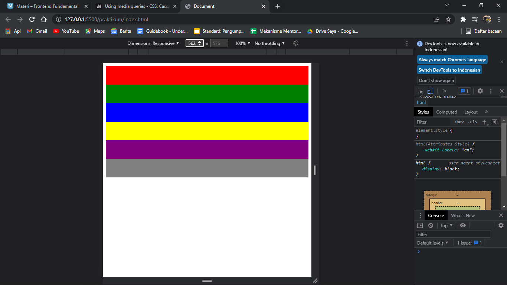
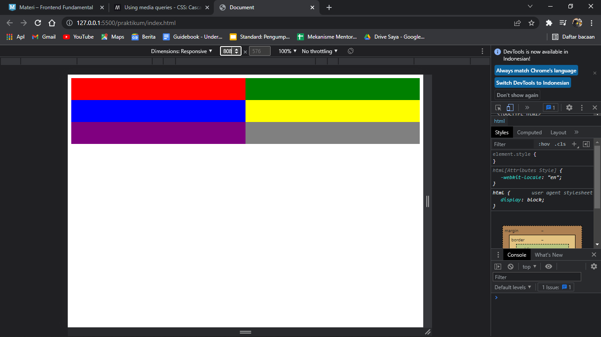
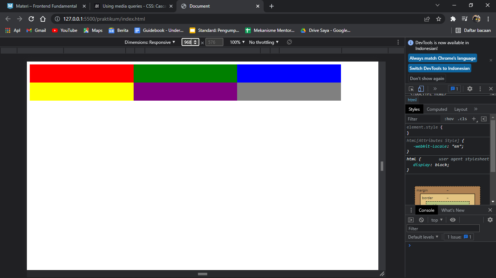
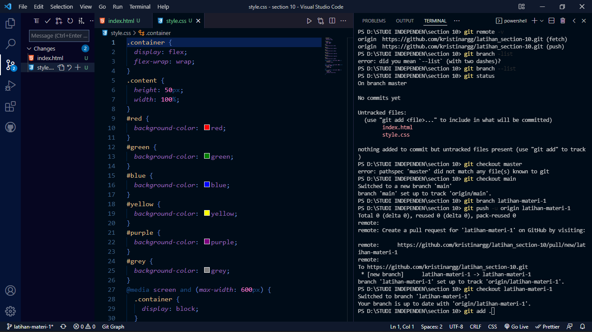
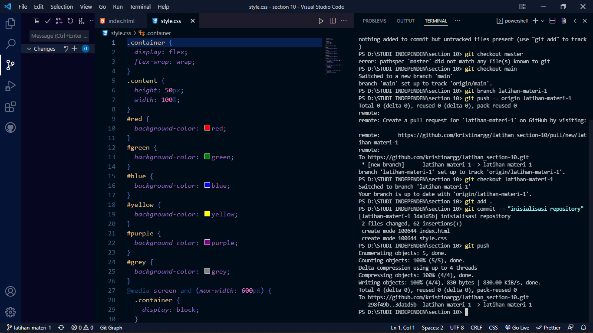

# (10) Frontend Fundamental

## Resume

3 poin yang dipelajari :

1. HTML dan CSS
2. Javascript dan Node.js
3. Git

### HTML & CSS

HTML adalah bahasa markup yang membuat dan menyusun halaman dan aplikasi website.

3 tag block-level yang harus dimiliki oleh setiap dokumen HTML adalah

1. `<html>`
2. `<head>`
3. `<body>`

CSS dipakai untuk mendesain atau mempercantik tampilan sebuah halaman atau tampilan website.

macam-macam CSS di dalam kode html

1. inline CSS
2. internal CSS
3. eksternal CSS

Media Query adalah module css yang membuat layout responsive sesuai dengan perangkat yang kita gunakan. Penggunaan media query pada css menggunakan `@media screen and (){}`

### Javascript & Node.js

Javascript digunakan untuk membuat website lebih interaktif atau hidup.

Kode javascript dapat di tulis langsung ke dalam kode html menggunakan tag `` diantara tag `<head>` dan tag `<body>`.

Node.js sebagai runtime environment untuk javascript. Dengan menggunakan node.js kita dapat menjalankan kode javascript.

NPM (Node Package Manager) dimana tool ini kita dapat menginstall dan menguninstall package, mengelola versi dan dependensi yang diperlukan untuk menjalankan proyek.

Key yang penting terdapat pada NPM adalah :

1. name
2. scripts
3. dependencies
4. devDependencies

### GIT

Git akan mencatat setiap perubahan pada file yang dikerjakan.

Git memiliki 3 area kerja

1. working directory (git add .)
2. staging area (git commit -m "pesan")
3. repository (git push)

Kata kunci penting pada Git :

- Modified, file yang telah diubah dan perubahannya tercatat
- staged, file yang kita telah add setelah melakukan perubahan
- Commit, mengambil atau memasukkan berkas-berkas dari staging area dan menyimpan ke dalam direktori.
- Branch, cerminan atau cabang direktori git

## Task

1. membuat tampilan responsive.
   berikut kode hasil praktikum ini

[link file index.html dan style.css](https://github.com/kristinargg/latihan_section-10/tree/latihan-materi-1)

2. membuat repository dan branch baru dengan nama latihan-materi-1

berikut adalah link repository:

[latihan-materi-1](https://github.com/kristinargg/latihan_section-10/tree/latihan-materi-1)
