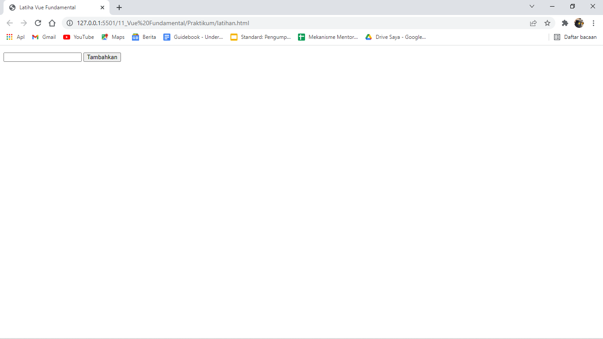
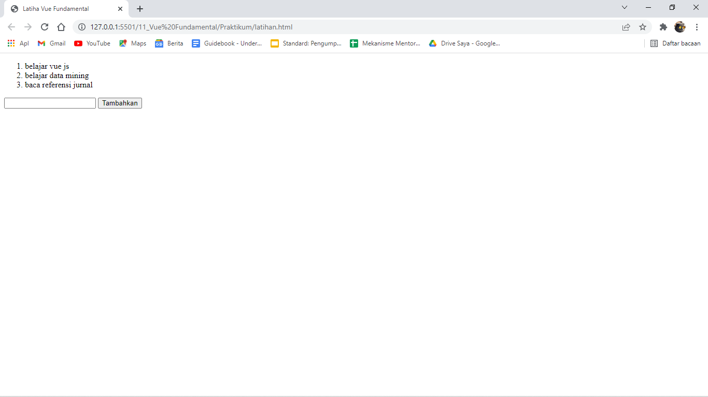
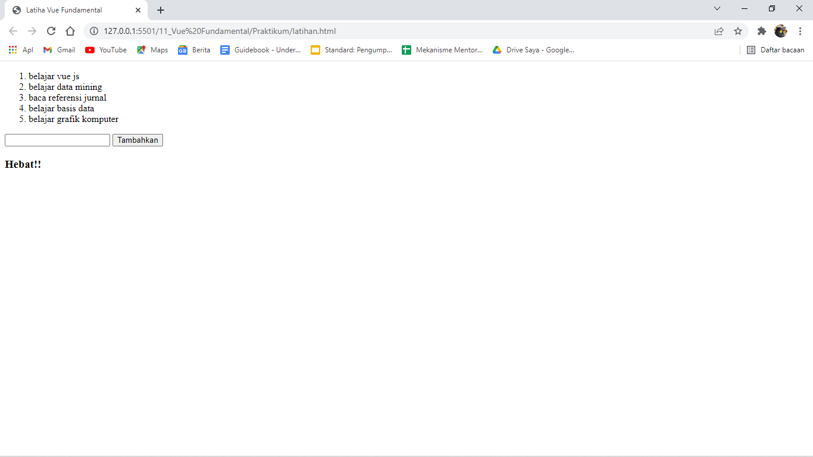

# (11) Vue Fundamental

## Resume

3 point yang dipelajari

1. Dasar-dasar Vue
2. Vue Directive
3. Computed properties and Watchers

Vue adalah framework javascript yang digunakan untuk membuat tampilan pada website agar lebih interaktif dan dinamis.

### Dasar-dasar Vue

- Vue instance, membuat vue instance dengan menggunakan selector id
- Vue data binding, 3 jenis data binding pada vue :
  1. didalam konten, menggunakan kurung kurawal `{}`
  2. di atribut elemen, menggunakan `v-bind`
  3. elemen html, menggunakan `v-html`
- vue reactivity, vue instance yang memiliki properti bernama `data`, jika dilakukan perubahan pada value data maka pada interface akan berubah

### Vue Directive

Vue directive adalah atribut khusus yang diawali`v-` dimana untuk menjalankan suatu perintah yang ada pada atribut.

1. v-bind, memberitahu Vue bahwa kita ingin melakukan one way dimana tidak akan merubah value interface.
2. v-model, memberitahu Vue bahwa kita ingin melakukan two way dimana value interface akan berubah.
3. v-if, v-else, dan v-else-if, digunakan untuk rendering secara kondisional.
4. v-on, untuk memanggil fungsi
5. v-for, memberitahu vue bahwa kita akan melakukan perulangan

### Computed properties and Watchers

- Computed properties, untuk melihat setiap perubahan yang terjadi dalam elemen
- Watchers, untuk memantau sebuah variabel dan melakukan tindakan tertentu saat terjadi perubahan pada nilai

## Task

Berikut hasil kode dari praktikum/latihan.

[latihan.html](./Praktikum/latihan.html)

output:

1. membuat sebuah input dan tombol
   

2. menunjukkan list todo yang telah ditambahkan dan reset input setelah tombol di klik
   

3. jika yang dimasukkan sama dengan atau lebih dari 4 maka tunjukan 'Hebat!' dibawah input
   
