# 2 Version Control and Branch Management (GIT)
## Resume

3 poin yang dipelajari
1. menyimpan perubahan repository
2. inspecting repository
3. membuat branch baru dan pull request

### Menyimpan perubahan repository
- Working directory (git add .), untuk menambahkan file baru yang dipilih
- Staging area (git commit), untuk menyimpan perubahan dengan memberi message tetapi tidak adanya perubahan pada repository
- Repository

### inspecting repository
- git log yaitu untuk melihat semua perubahan yang pada repository
- git checkout yaitu untuk memeriksa kondisi file dan berpindah branch

### Branch dan Pull Request

### Branch
Branch merupakan pembuatan percabangan didalam github dan berfungsi untuk melindungi main file/project.
Dalam membuat branch baru menggunakan perintah `git branch <nama_branch>` dan untuk melihat list branch pada repository menggunakan perintah `git branch --list`

### Pull Request
pull request yaitu untuk meminta menggabungkan (merge) pada suatu file yang telah di perbaharui atau modifikasi pada repository

## Task
### masukkan project dan buat project sebagai master
berikut screenshot

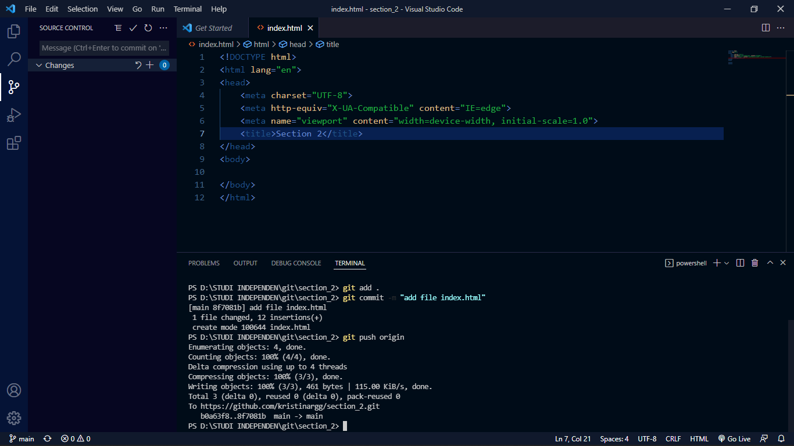

### buat branch baru berfungsi sebagai develop

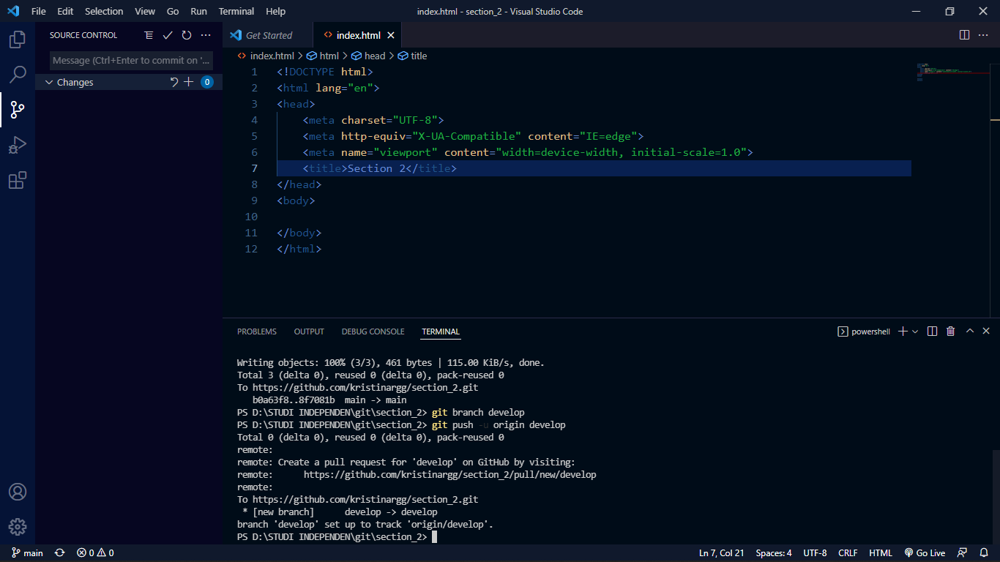

### buat branch ketiga sebagai penambahan fitur, melakukan penambahan fitur dan merge branch ketiga ke dalam branch develop
membuat branch ke tiga

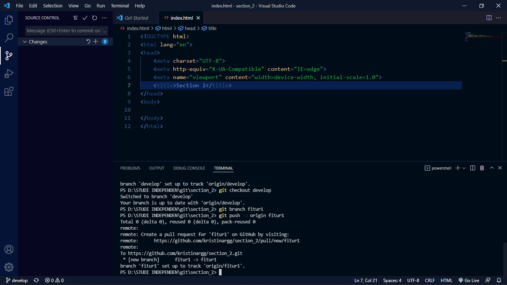

melakukan penambahan fitur

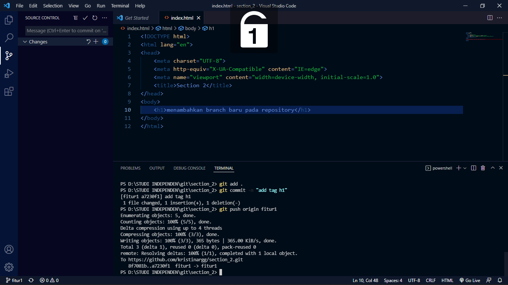

merge branch ketiga ke dalam develop

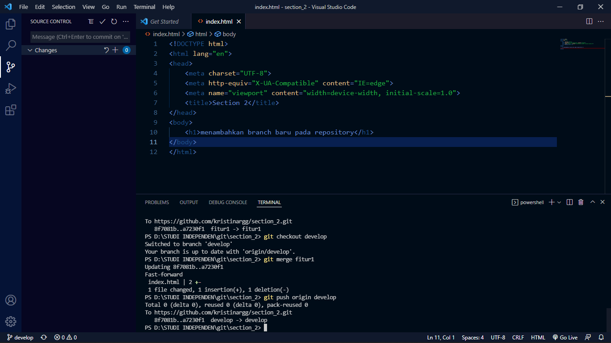

### buat branch keempat sebagai penambahan fitur, melakukan penambahan fitur dan merge branch keempat ke dalam branch develop

membuat branch keempat

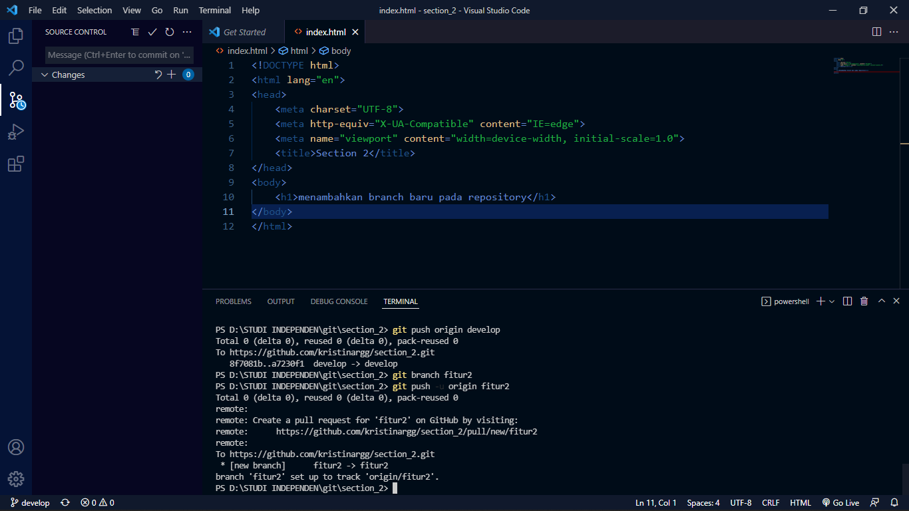

melakukan penambahan fitur

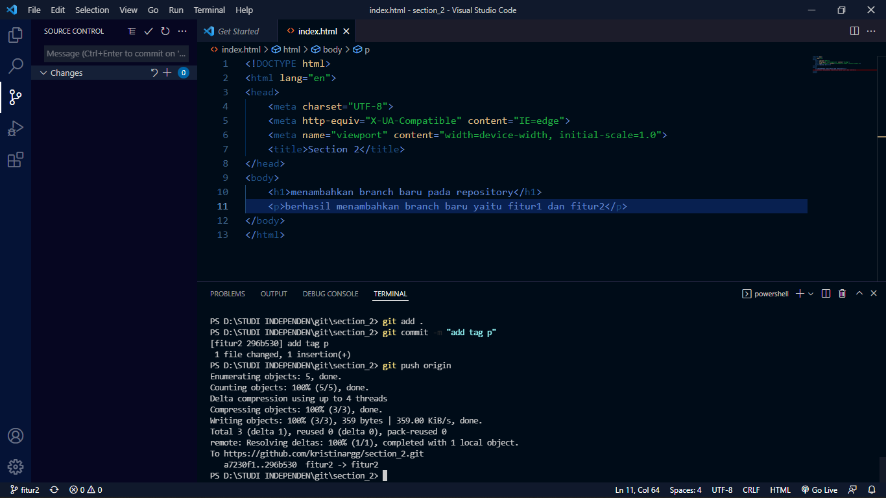
merge branch keempat ke dalam develop

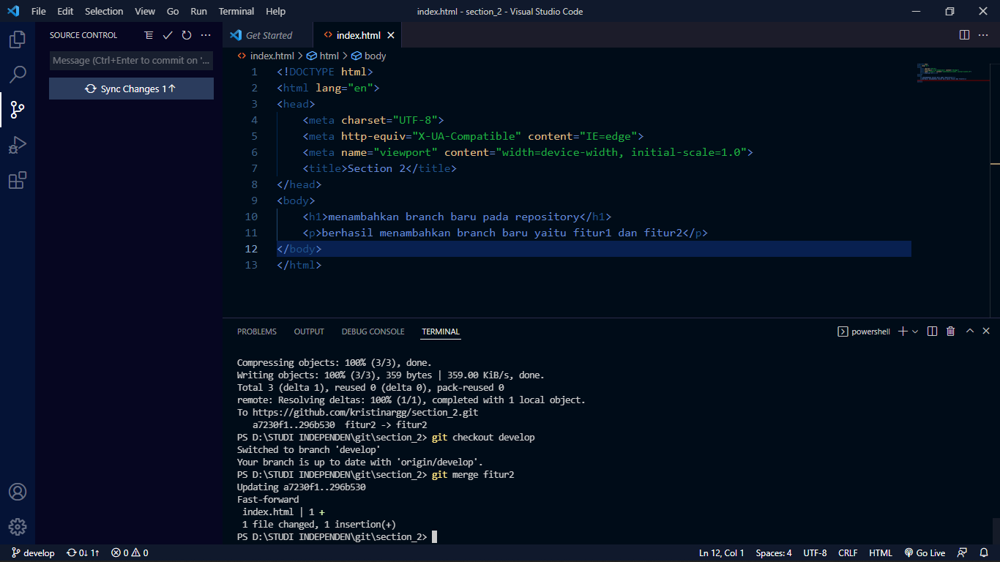

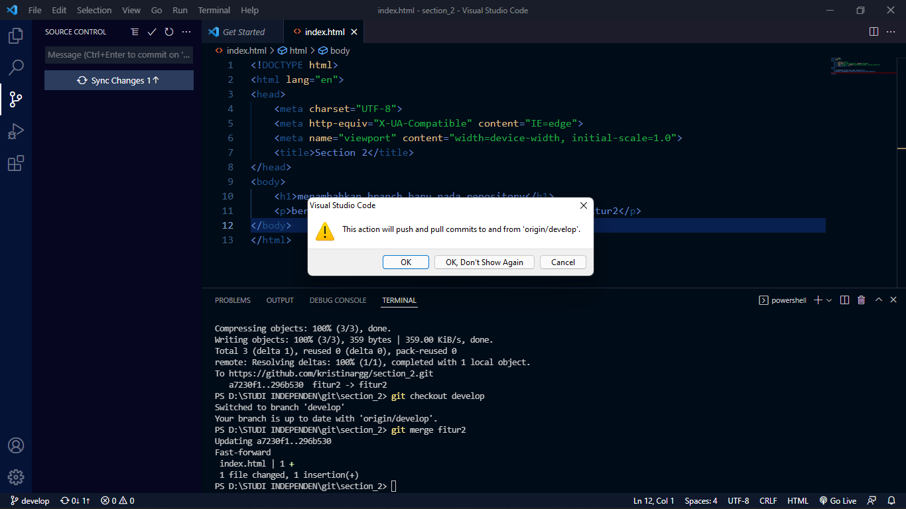

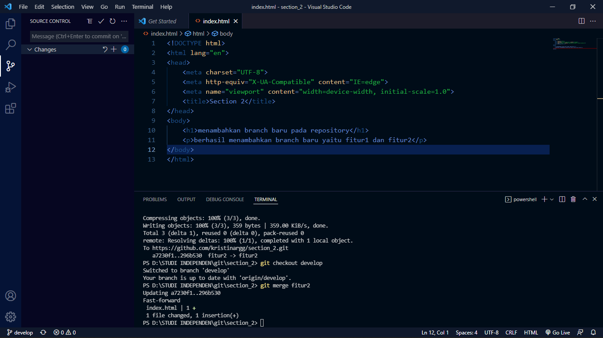

### screenshot insight network

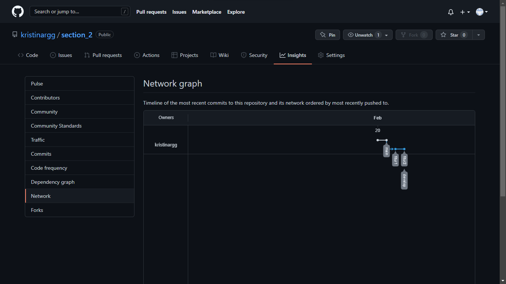

### link repository

[link repository](https://github.com/kristinargg/section_2)
