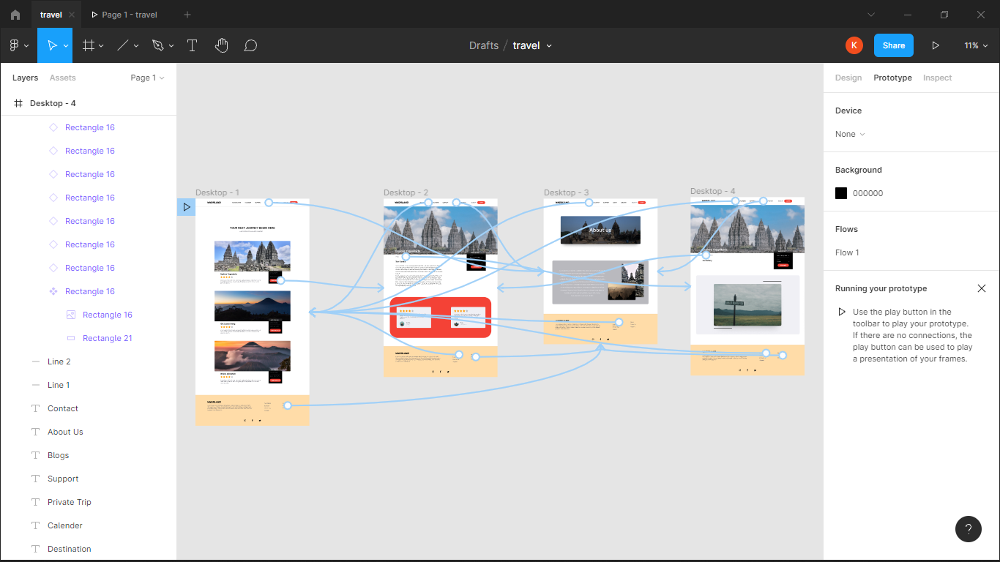

# (4) Figma

## Resume

3 poin yang dipelajari
1. Apa itu figma
2. Membuat frame dan grid pada figma
3. Membuat prototype scrolling

### Figma 

Figma adalah editor grafik vektor dan alat prototyping berbasis web. Figma tersedia secara gratis dan harus terhubung internet

IDE/Tools dalam figma
- Grid and layout columns
- Importing Old Sketch File
- Setting up New Frames
- Layer and Groups
- Images
- Typography

### Membuat frame dan grid
dalam membuat figma kita dapat menggunakan toolsbar yang ada dibagian atas sebelah kiri atau menggunakan shortcut `f` 
dan untuk membuat grid sebelah kanan klik `layout grid` lalu atur sesuai kebutuhan

### Membuat prototype scrolling

untuk membuat scrolling, pilih terlebih dahulu frame yang akan diberi scrolling lalu pada sidebar kanan atas pilih `prototype`. untuk menambahkan scrolling pilih `overflow scrolling` dan pilih salah satunya

## Task 
mendesign website dan membuat prototype pada design website

hasil dari prototype

dan link prototype figma pada dokumen txt

[4_Figma.txt](./Praktikum/4_Figma.txt)
