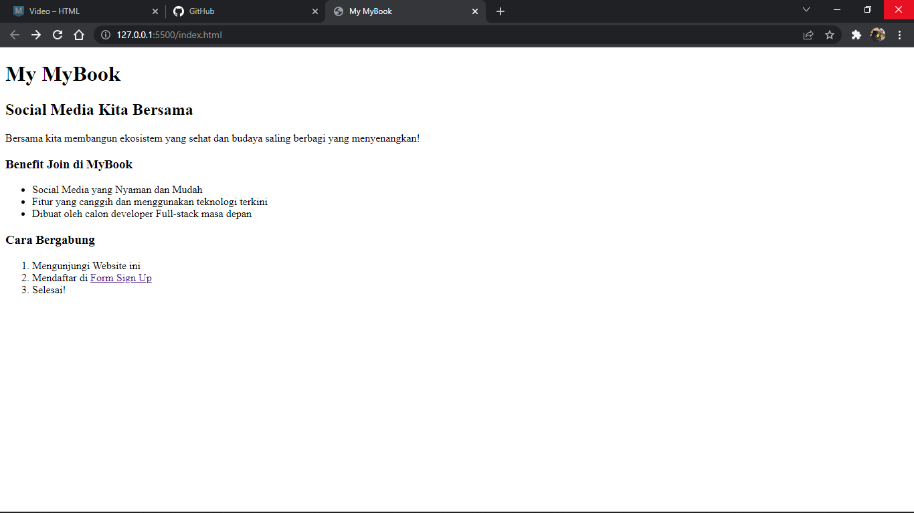
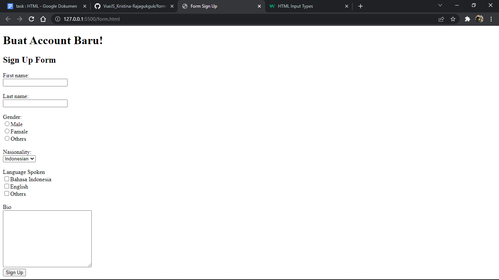
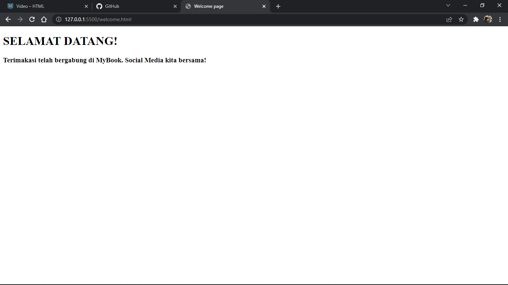

# (5) HTML

## Resume

3 poin yang dipelajari
1. apa itu frontend
2. apa itu html
3. tag-tag html

### Frontend

Frontend adalah orang yang berperan dalam mengembangkan tampilan website atau aplikasi yang menarik kepada user

Frontend akan dibangun dari 3 komponen utama yaitu html, javascript dan css

html = sebagai struktur yang membangun tampilan website

javascript = memberikan fungsi-fungsi pada website atau aplikasi agar lebih hidup

css = untuk mempercantik tampilan website

### HTML

Html singkatan dari hypertext markup language yang digunakan bahasa standart yang digunakan secara luas untuk membangun dan menampilkan halaman website

Kegunaan html 
- membangun struktur halaman website 
- mengatur tampilan dan isi dari halaman web
- membuat tabel dengan tag `<table></table>` html
- membuat form dengan tag `<form></form>` html
- membuat gambar dengan canvas

### Tag-tag HTML
tag -tag utama di html 
- `<!doctype html>` , untuk menginformasikan bahwa dokumen bertipe html
- `<html></html>`, untuk memulai program html
- `<head></head>`, bagian kepala dari dokumen dimana dapat memberi judul dari halaman website
- `<body></body>`, berisi konten atau isi dari halaman yang terlihat pada website

# Task

### membuat halaman website dalam sebuah file dengan index.html, form.html dan welcome.html

berikut kode hasil dari praktikum

1. [index.html](./Praktikum/index.html)

output :

2. [form.html](./Praktikum/form.html)

output : 

3. [welcome.html](./Praktikum/welcome.html)

output : 

