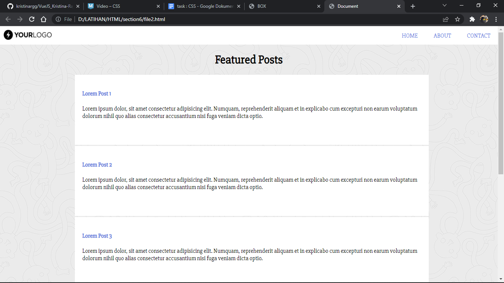

# (7) CSS

## Resume

3 hal yang dipelajari
1. pengertian CSS
2. 3 cara menambahkan file CSS ke dalam html
3. CSS selector

### CSS

CSS kepanjangan dari cascading style sheets yang digunakan untuk mempercantik atau menghias dan dapat mengatur posisi pada halaman web menggunakan atribut atau properties float, display, position, color dan lain-lain.

### menambahkan file css ke dalam html

1. External CSS, sintaks ini disisipkan didalam tag `head` pada html menggunakan tag `link` dan mengisi pada tag "herf" yang ekstensi file css `.css`
2. internak CSS, sintaks ini dapat digunakan dalam satu file html dengan menggunakan tag ``
3. inline CSS, sintaks ini dapt digunakan untuk elemen tunggal pada HTML

### CSS selector

CSS selector adalah pola yang digunakan untuk memilih element yang ingin distyling

Penanda HTML ke dalam CSS, dapat menggunakan selector ID diberi penanda `#` dan Class diberi penanda `.` pada saat menggunakan css.

## Task 
menampilkan box dan memberi warna pada masing masing box pada file1.html dan membuat halaman web pada file2.html

berikut adalah kode file
1. [file1.html](./Praktikum/file1.html) dan file css [file1.html](./Praktikum/css/file1.css)

output :

2. [file1.html](./Praktikum/file2.html) dan file css [file1.html](./Praktikum/css/file2.css)

output :

