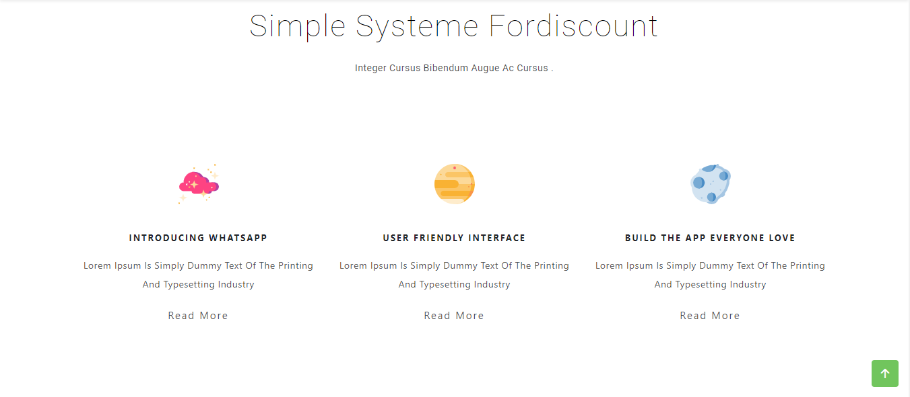
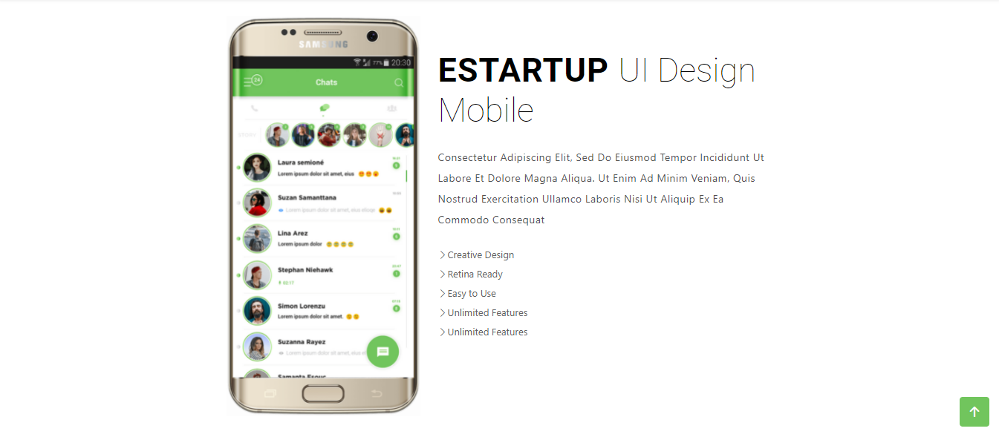
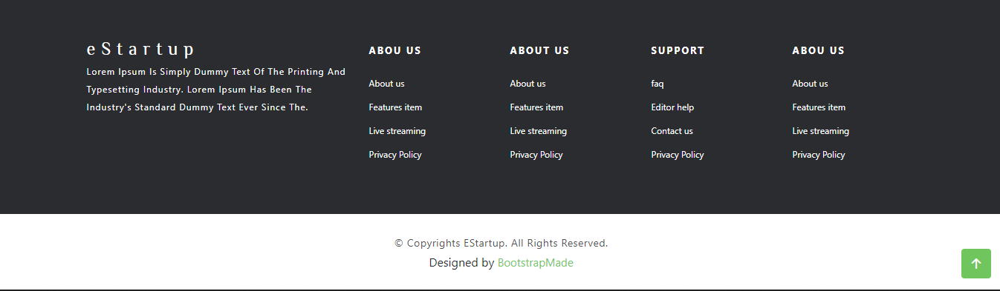

# (7) Bootstrap

## Resume
3 poin yang dipelajari :
1. Bootstrap
2. Class-class pada bootstrap
3. Sistem Grid pada bootstrap

### Bootstrap

Bootstrap adalah kerangka css yang mempermudah untuk membuat suatu tampilan website dan responsive. 
Bootstrap digunakan karena gratis dan mudah untuk dipelajari.

### Class-class pada bootstrap

1. container, digunakan sebagai element layout dasar pada bootstrap. pada bootstrap penggunaan class container yaitu container dan container-fluid
2. row, digunakan pada sistem grid dan sebagai salah satu element yang digunakan pada bootstrap untuk membuat website responsive.
3. column, digunakan pada sistem grid dan element lain yang membuat website responsive. penggunaan class column pada bootstrap yaitu col-md-12, col-lg-12, col-sm-6.
4. button, digunakan untuk membuat tombol langsung. contoh penggunaan class button pada bootstrap yaitu btn-primary, btn-danger dan lain-lain

### Sistem Grid

Sistem Grid adalah pengaturan lebaran untuk masing-masing komponen dimana bertujuan untuk mengatur responsive website yang kita buat. 
Pada bootstrap sistem grid terdiri dari row dan column dimana 1 row didalamnya terdapat 12 column.

## Task

pada task ini untuk membuat header, body dan footer.
berikut adalah kode hasil dari praktikum ini

[index.html](./Praktikum/index.html)

output:

1. header

2. body

3. footer

