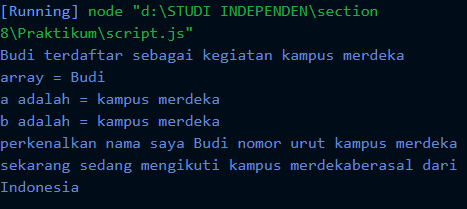
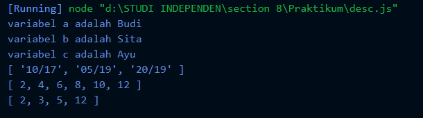

# (8) Javascript Refreshment

## Resume

3 poin yang dipelajari :

1. declaration, scoping dan hoisting
2. distructuring, method, control flow
3. document object model

javascript adalah bahasa pemrograman untuk membuat website menjadi lebih interaktif dan dinamis.

### Declaration, Scoping dan Hoisting

Declaration adalah proses pembuatan atau mendefinisikan variabel untuk menyimpan data.
untuk mendeklarasikan variabel pada javascript menggunakan var, let dan const.

Scoping untuk menentukan dimana variabel, fungsi dan objek akan kita letakkan dalam kode kita.
lokasi scoping terdiri dari global, function dan block.

Hoisting membuat beberapa jenis variabel atau fungsi dapat diakses sebelum dideklarasikan.

- Deklarasi var dan function adalah hoisted karena dapat digunakan sebelum dideklarasikan.

- Deklarasi let dan conts tidak hoist karena tidak dapat digunakan jika belom dideklarasikan.

### Distructuring, Method, Control flow

Distructuring adalah untuk mensalin nilai atau value dari array atau atribut dari objek ke dalam variabel baru atau berbeda.

Method adalah sebuah fungsi yang terkait dengan objek dimana membuat program menjadi lebih sederhana.
Method terdiri dari concat, map, foreach, slice, filter, dan reduce dimana mempunyai fungsi masing-masing.

Control Flow untuk mengatur alur program sesuai dengan apa yang kita inginkan.
Control flow ada perulangan (loop) dan percabangan (pengkondisian)

perulangan terdiri dari :

1. for
2. while
3. do while

percabangan terdiri dari :

1. if... else
2. switch
3. block
4. Try Catch
5. breack
6. continue
7. throw

### Document object model

DOM adalah API HTLM untuk merepresentasikan halaman web pada suatu dokumen, dimana menyediakan sekumpulan fungsi dan atribut yang bisa dimanfaatkan.

DOM terdiri dari :

1. Selection Manipulation
   contoh : `getElementById()`, `getElementByTagName()` dan lain-lain.
2. Manipulation
   contoh : `element.innerHTML`, `elemen.setAttribute()` dan lain-lain.
3. Event
   contoh : `onclick`, `onchange`, `onblur`, `oncopy` dan lain-lain.

## Task

1. membuat program sederhana menggunakan javascript untuk tugas no 1 . berikut hasil dari kode yang telah dikerjakan.

[script.js](./Praktikum/script.js)

output :

2. hasil tugas no 3, 4, 5 dan 6. berikut kode yang telah dikerjakan

[desc.js](./Praktikum/desc.js)

output :

berikut dokumen untuk tugas dari section 8.
[8_Javascript.docx](./Praktikum/8_Javascript.docx)
